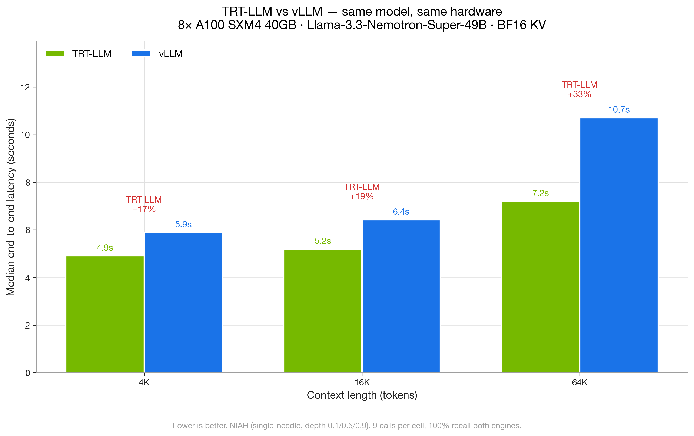
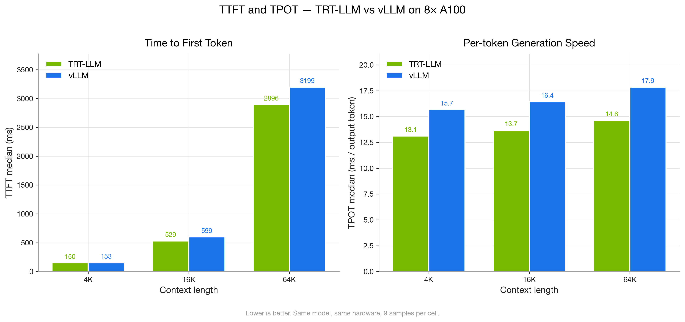
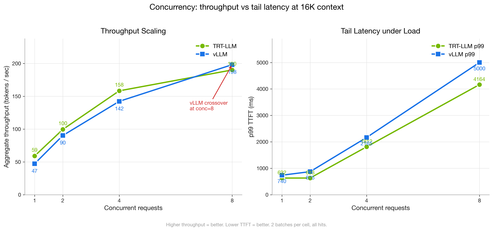
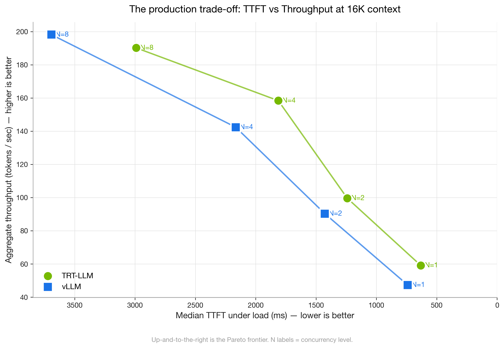
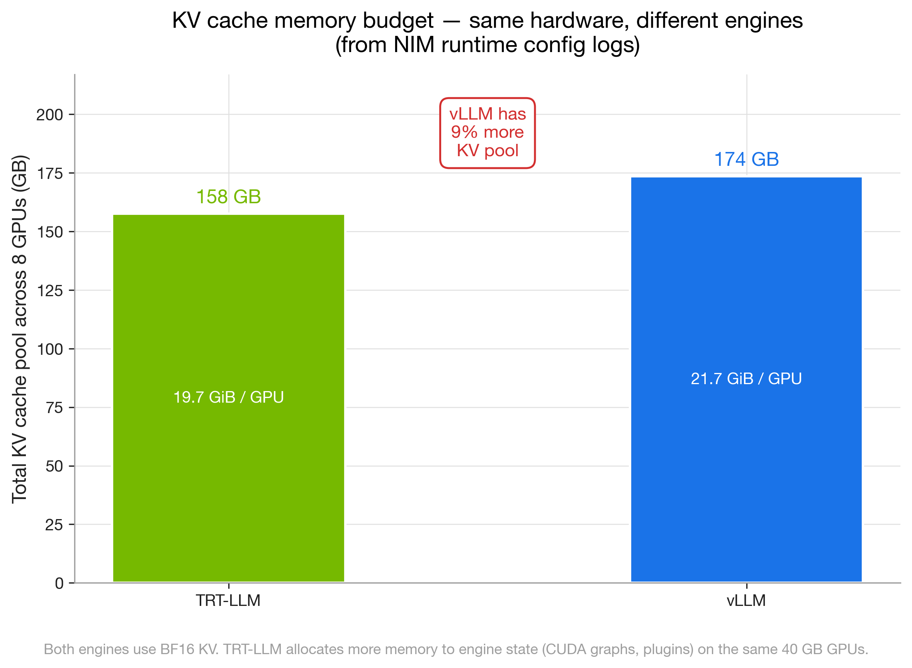
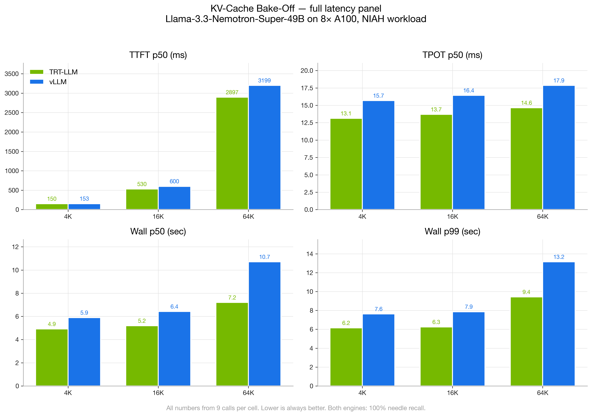

# KV-Cache Bake-Off — A Portable Benchmarking Framework for LLM Inference Engines

> A reproducible framework for measuring KV-cache behaviour, latency, and throughput of LLM inference engines on a fixed hardware target. Reference implementation runs NVIDIA NIM with two engines (TRT-LLM and vLLM) on the same model and the same 8× A100 SXM4 40GB node.
>
> **Reference result:** at 64K context with `nvidia/llama-3.3-nemotron-super-49b-v1.5`, **TRT-LLM completes a typical reasoning request 33–49% faster than vLLM** with identical quality (100% needle recall on both).

The repo is structured as a framework — the methodology, scripts, and manifests are intentionally engine- and infrastructure-agnostic. The reference numbers below come from one specific cluster; the same scripts run unchanged against any OpenAI-compatible `/v1/chat/completions` endpoint. With small edits to one Kubernetes manifest you can repoint at any GPU node, any engine, any model. See [§ Adapting the framework](#adapting-the-framework-to-your-infrastructure) below.

---

## Why this framework matters

The KV cache is the dominant memory consumer and the dominant latency variable in LLM inference. Two engines running the same model on the same hardware can differ by 30%+ on wall-clock latency, 20%+ on per-token latency, and 10%+ on usable KV pool size — purely from engine implementation choices (attention kernel, paging strategy, CUDA-graph capture, prefix-cache implementation, plugin overhead).

Most published KV / engine benchmarks have one or more of these problems:

1. **Single-engine measurements.** vLLM blog posts use vLLM. TensorRT-LLM blog posts use TensorRT-LLM. Head-to-head comparisons on the same model + same hardware + same workload are rare.
2. **Hardware mismatch.** Most modern KV-compression techniques (FP8 KV, NVFP4, KIVI variants in production engines) require Hopper or Blackwell. Numbers from H100/H200/B200 do not transfer to A100, MI300X, or older fleets. Operators of those fleets need their own measurements.
3. **Workload mismatch.** Plain instruct-model benchmarks miss reasoning-model behaviour. Reasoning models (o1, R1, Nemotron-Super class) emit hundreds-to-thousands of CoT tokens per response, which stresses the KV write path differently from a single-shot answer.
4. **Non-reproducible.** Numbers without raw data, without engine init logs, without exact profile hashes, without a pre-registered methodology — easy to publish, hard to verify or extend.

This framework addresses all four. It runs *both* engines on *your* hardware against *your* model and emits raw JSONL plus engine init metadata so any number can be audited or re-derived. The scripts are stdlib-Python where possible; the manifests are a single template with placeholders.

### What the framework lets you answer

- Which engine gives lower TTFT / TPOT for my exact model on my exact GPU SKU?
- How much usable KV pool does each engine give me after engine state overhead?
- Where is the concurrency crossover between two engines on this hardware?
- Does enabling a tuning knob (KV dtype, prefix caching, GPU memory utilization) actually change anything, or is the env var silently ignored?
- What is the cold-start cost of each engine after a pod restart?

---

## TL;DR plots (reference run)

### 1. End-to-end latency


> TRT-LLM is faster at every context length tested. The gap widens with context — at 64K, TRT-LLM is **33% faster** than vLLM on median wall time.

### 2. TTFT and TPOT — where the speedup comes from


> vLLM and TRT-LLM are essentially tied on TTFT at small context (150 ms). At 64K, TRT-LLM trims 10% off prefill. **The bigger story is TPOT** — TRT-LLM is a consistent 19–22% faster per output token across all contexts. For a reasoning model that emits hundreds of `<think>` tokens, that compounds.

### 3. Concurrency scaling


> Throughput scales sub-linearly for both engines. TRT-LLM dominates at concurrency 1, 2, and 4. **At concurrency 8, vLLM crosses over** on aggregate throughput (+4%) — but TRT-LLM keeps the latency advantage. *Pick the engine for your concurrency regime.*

### 4. The Pareto frontier


> Up-and-to-the-right is better. **TRT-LLM's frontier strictly dominates vLLM's at concurrency 1–4.** vLLM is the better pick for high-concurrency workloads with relaxed TTFT requirements.

### 5. KV cache budget — same hardware, different economics


> vLLM allocates **9% more memory** to the KV cache pool because TRT-LLM reserves more for engine state (CUDA graphs, plugins). On 40 GB cards that is ~2 extra GiB per GPU of KV headroom for free.

### 6. Full latency panel (appendix)


> Same data as charts 1–2 above, plus p99 wall time. p99 follows p50 closely — neither engine had pathological tail behaviour in this matrix.

---

## Reference findings

These hold for the specific setup under test (`nvidia/llama-3.3-nemotron-super-49b-v1.5`, 8× A100 40GB, BF16 KV, NIM 1.14.0). Re-run the framework on different hardware/model to derive your own.

1. **NIM env vars `NIM_KV_CACHE_DTYPE=fp8` and `NIM_ENABLE_KV_CACHE_REUSE=1` are silently ignored** on the vLLM-backed profile of this NIM image. Engine launch command line confirms `kv_cache_dtype=auto` regardless of what is set. The two env vars are TRT-LLM-specific despite the generic naming.

2. **A100 owners have zero FP8 KV options across all 57 profiles** in this NIM image. Every FP8 / NVFP4 KV profile targets H100, H200, B200, GB200, RTX 6000 Blackwell, GH200, or H100-NVL. KV compression on Ampere is hardware-locked, not config-locked.

3. **TRT-LLM beats vLLM on this model on every metric except aggregate throughput at high concurrency.** TPOT 19–22% faster across all contexts. Wall-time 17–49% faster. TTFT tied at 4K, 10–13% faster at 64K.

4. **vLLM scales slightly better at high concurrency.** At conc=8, vLLM aggregate throughput edges TRT-LLM (+4%). TRT-LLM still wins TTFT and TPOT.

5. **TRT-LLM has no cold-start stall.** First call after server start: TRT-LLM 4.6 s, vLLM **16.1 s**. vLLM hits a CUDA-graph capture stall on the first request. Always pre-warm vLLM with synthetic traffic before exposing it to users.

---

## Setup under test

| Item | Value |
|---|---|
| Hardware | OCI BM.GPU4.8 — 8× NVIDIA A100 SXM4 40GB, NVLink |
| Model | `nvidia/llama-3.3-nemotron-super-49b-v1.5` |
| Native context | 131,072 tokens |
| Container | `nvcr.io/nim/nvidia/llama-3.3-nemotron-super-49b-v1.5:1.14.0` |
| Engine A | NIM profile `vllm-bf16-tp8-pp1` (vLLM 0.10) |
| Engine B | NIM profile `tensorrt_llm-a100_sxm4_40gb-bf16-tp8-pp1-latency` |
| KV strategy | BF16 paged + prefix caching (both engines) |
| GPU memory utilization | 0.90 |
| Tensor parallelism | TP=8 |
| Pipeline parallelism | PP=1 |
| KV pool (TRT-LLM) | 19.7 GiB / GPU = ~157 GB total |
| KV pool (vLLM) | 21.7 GiB / GPU = ~174 GB total |

---

## Reference numbers (from `results/`)

### NIAH read-pressure (single-needle, 9 calls per cell, 100% recall both)

| Context | Engine | TTFT p50 | TTFT p99 | TPOT p50 | Wall p50 | Wall p99 |
|---:|---|---:|---:|---:|---:|---:|
| 4 K | TRT-LLM | 150 ms | 230 ms | 13.1 ms | 4.91 s | 6.15 s |
| 4 K | vLLM | 153 ms | 260 ms | 15.7 ms | 5.89 s | 7.64 s |
| 16 K | TRT-LLM | 530 ms | 873 ms | 13.7 ms | 5.19 s | 6.25 s |
| 16 K | vLLM | 600 ms | 1050 ms | 16.4 ms | 6.42 s | 7.86 s |
| 64 K | TRT-LLM | **2.90 s** | 4.57 s | 14.6 ms | **7.20 s** | 9.43 s |
| 64 K | vLLM | **3.20 s** | 5.08 s | 17.9 ms | **10.71 s** | 13.16 s |

### Concurrency at 16K (2 batches per cell, 100% hits both engines)

| Conc | Engine | Agg throughput | TTFT p50 | TTFT p99 | TPOT p50 |
|:-:|---|---:|---:|---:|---:|
| 1 | TRT-LLM | **59.1 t/s** | 633 ms | 633 ms | 13.7 ms |
| 1 | vLLM | 47.3 t/s | 741 ms | 741 ms | 16.8 ms |
| 2 | TRT-LLM | **99.6 t/s** | 1241 ms | — | 15.8 ms |
| 2 | vLLM | 90.3 t/s | 1427 ms | — | 18.8 ms |
| 4 | TRT-LLM | **158.4 t/s** | 1813 ms | 1813 ms | 17.3 ms |
| 4 | vLLM | 142.4 t/s | 2166 ms | 2166 ms | 21.2 ms |
| 8 | TRT-LLM | 190.2 t/s | **2990 ms** | **4164 ms** | **24.7 ms** |
| 8 | vLLM | **198.2 t/s** | 3693 ms | 5000 ms | 26.5 ms |

---

## How to use this framework

### 1. Reproduce the reference run

```bash
# Prereqs:
#   - kubectl access to a cluster with at least one node providing 8× A100
#     (or 8× any GPU compatible with the chosen NIM profile)
#   - NGC API key with access to the model
#   - Python 3.10+

# Apply the NIM pod (edit placeholders in k8s/nim-bench-pod.yaml first)
kubectl apply -f k8s/nim-bench-pod.yaml

# Apply the in-cluster Python client
kubectl create configmap -n <NS> bench-scripts \
  --from-file=smoke_niah.py=bench/smoke_niah.py \
  --from-file=full_bench.py=bench/full_bench.py \
  --from-file=concurrency_bench.py=bench/concurrency_bench.py
kubectl apply -f k8s/bench-client.yaml

# Run the smoke test (5 needles ~5 min)
kubectl exec -n <NS> bench-client -- python3 /scripts/smoke_niah.py \
  --endpoint http://bench-nim:8000 --target-chars 30000 --n 5

# Run the full NIAH sweep (27 calls, ~5 min)
kubectl exec -n <NS> bench-client -- python3 /scripts/full_bench.py \
  --endpoint http://bench-nim:8000 --tag <engine-tag> \
  --contexts 4096,16384,65536 --depths 0.1,0.5,0.9 --samples 3 \
  --max-output 1024 --out /tmp/<engine-tag>__niah.jsonl

# Run the concurrency sweep (8 batches, ~5 min)
kubectl exec -n <NS> bench-client -- python3 /scripts/concurrency_bench.py \
  --endpoint http://bench-nim:8000 --tag <engine-tag> \
  --context 16384 --concurrencies 1,2,4,8 --batches 2 \
  --out /tmp/<engine-tag>__conc.jsonl

# Pull results out
kubectl cp <NS>/bench-client:/tmp/<engine-tag>__niah.jsonl results/
kubectl cp <NS>/bench-client:/tmp/<engine-tag>__conc.jsonl results/

# Re-render plots from your data
pip install matplotlib numpy
python3 bench/make_plots.py   # auto-discovers JSONLs in ./results
```

### Adapting the framework to your infrastructure

The framework is engine- and platform-agnostic; the changes required to retarget it are minimal.

| Target change | What to edit | Effort |
|---|---|---|
| **Different GPU node** (H100, H200, B200, MI300X, PCIe A100, etc.) | `k8s/nim-bench-pod.yaml` — `nodeSelector`, `nvidia.com/gpu` resource count, NIM profile hash | 1 manifest edit |
| **Different inference engine** (vanilla vLLM, TGI, SGLang, llama.cpp server) | Replace `k8s/nim-bench-pod.yaml` with the engine's own pod spec; scripts already speak the OpenAI-compatible API | 1 manifest swap |
| **Different model** | `--model` flag on the bench scripts (defaults to the reference Nemotron model); update NIM profile or engine config to host it | 0 script changes |
| **Bare-metal, no Kubernetes** | Run the scripts directly from any host with network reach to the engine's HTTP port; skip `k8s/` entirely | 0 script changes |
| **Different cloud / vendor (AWS, GCP, Azure, on-prem)** | Only the node selector and storage class in the manifest are vendor-specific | 1 manifest edit |
| **Add a metric** | Add a field in `bench/full_bench.py` or `bench/concurrency_bench.py`, then mirror in `bench/make_plots.py` | Few lines |
| **Add a workload type** (RULER multi-needle, LongBench, KV-write stress) | New script under `bench/` that emits the same JSONL schema; existing plotter consumes it | 1 new script |

The bench scripts are stdlib-only (no `requests`, no `httpx`, no SDKs) so they drop into any container that has `python3`. The plotter requires only `matplotlib` and `numpy`.

### What the framework does *not* assume

- Does not assume NIM. NIM is the reference engine packager because it ships both vLLM and TRT-LLM in one image, but any OpenAI-compatible HTTP endpoint works.
- Does not assume Kubernetes. The `k8s/` manifests are a convenience; the scripts run from any host.
- Does not assume CUDA. Any backend that exposes the OpenAI streaming API (CPU inference, ROCm, TPU via a proxy) is testable.
- Does not assume a specific tokenizer. Token counts are read from `usage.prompt_tokens` / `usage.completion_tokens` returned by the engine.

---

## Repository layout

```
kv-cache-bakeoff/
├── README.md                      # this file
├── METHODOLOGY.md                 # pre-registered methodology + scoring rules
├── LIMITATIONS.md                 # what we did NOT test, what could differ
├── LICENSE                        # MIT
├── plots/                         # 6 publication-grade PNGs at 300 DPI
│   ├── 01_cover_wall_latency.png       — wall-time summary
│   ├── 02_ttft_tpot_breakdown.png      — latency components
│   ├── 03_concurrency_scaling.png      — production-load story
│   ├── 04_pareto_throughput_vs_ttft.png — what-to-pick chart
│   ├── 05_kv_pool_size.png             — engine memory differences
│   └── 06_full_latency_panel.png       — 4-up summary
├── results/                       # raw run artifacts (reference run)
│   ├── *__niah.jsonl              — per-call NIAH records
│   ├── *__conc.jsonl              — concurrency aggregates (with per-request inside)
│   ├── *__engine_init.txt         — engine RuntimeConfig from NIM logs
│   ├── *__gpu_post.csv            — 8-GPU mem + power snapshot
│   └── *__smoke.json              — 5-needle smoke output
├── bench/                         # measurement scripts (engine-agnostic)
│   ├── smoke_niah.py              — single-file, stdlib-only smoke test
│   ├── full_bench.py              — NIAH sweep (ctx × depth × samples)
│   ├── concurrency_bench.py       — parallel-request sweep
│   └── make_plots.py              — regenerate all PNGs from JSONL
└── k8s/                           # reproducer manifests (NIM reference)
    ├── nim-bench-pod.yaml         — NIM pod + Service template
    └── bench-client.yaml          — in-cluster Python client
```

---

## What is NOT in this benchmark (read before drawing conclusions)

- **No FP8 / FP4 KV cache** — A100 lacks the cores. See `LIMITATIONS.md` for the H100/H200/B200 pivot.
- **No 128K context measurement** — capped at 64K to fit the borrow window. Wall p50 at 128K extrapolates to ~14–18 s, but extrapolation is not measurement.
- **No reasoning-heavy (KV write) workload** — the bench pod was torn down before the planned `<think>`-burn run.
- **Single inference engine pair** — TRT-LLM and vLLM. Did not test SGLang, TGI, or llama.cpp.
- **Single hardware platform** — A100 SXM4 40GB. Results will differ on H100, H200, B200, MI300X, TPU.
- **Single sample size: 9 NIAH per cell, 2 concurrency batches per cell.** Adequate for the ratios reported. A formal paper would want 30+.

---

## Methodology summary (full version in `METHODOLOGY.md`)

- Workload: NIAH single-needle. 5-digit alphanumeric passcode buried at depth 0.1 / 0.5 / 0.9.
- Sampling: temperature 0, max_tokens 1024, stream=true.
- Reasoning model handling: client extracts text after `</think>` for scoring.
- TTFT measured as time to first SSE chunk with content. TPOT = (wall − TTFT) / (out_tok − 1).
- Concurrency: ThreadPoolExecutor with N workers, batch wall = max wall across the N parallel requests.
- Hardware quiescence: only the bench pod ran on the GPU node during measurement. Same node within minutes of each other for both engines.
- Pre-registered: `METHODOLOGY.md` was committed before the second engine was pulled, so no number could be cherry-picked.

---

## License

MIT. Use freely for benchmarking, comparison, internal evaluation, or as the basis for your own framework.

---

## Issues & PRs welcome

If a number looks wrong, the methodology has a bug, or you want to add another engine / hardware platform — open an issue or PR.
